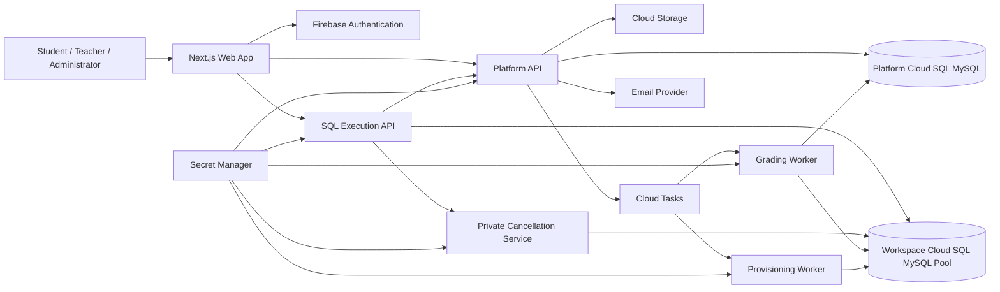
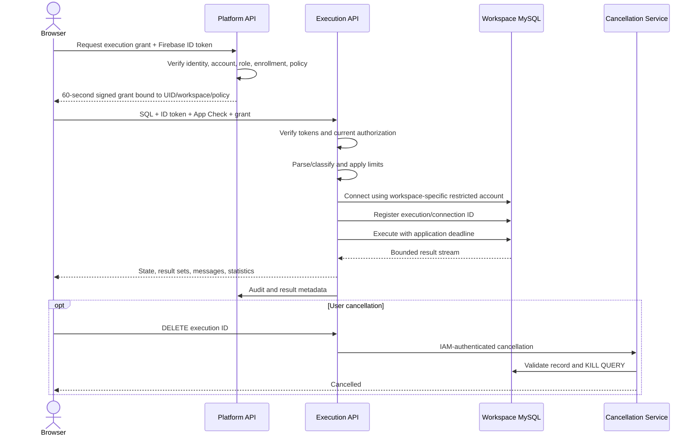
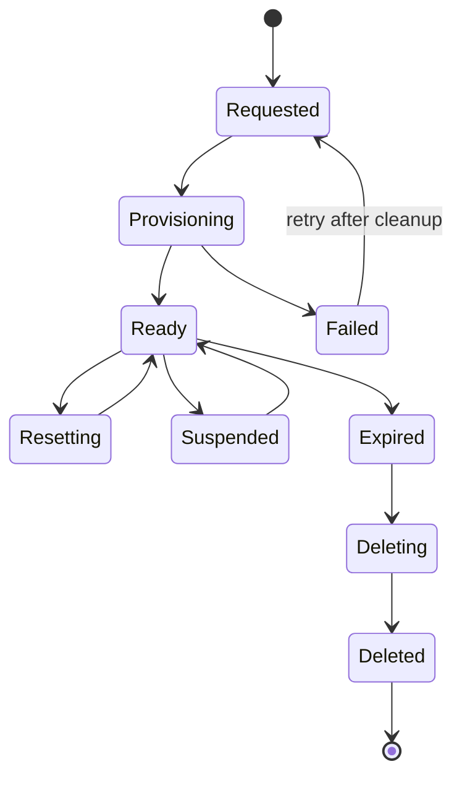

# SQWeb Architecture

Status: Approved planning baseline  
Last updated: 2026-08-18

Implementation note: Milestone 4 realizes the provisioning boundary with a separate worker, platform/workspace MySQL security domains, per-workspace accounts, Google Secret Manager version references (or a production-rejected local adapter), replacement reset, and persistent bounded cleanup retries. Interactive SQL remains unimplemented.

## 1. Architectural principles

1. The browser never connects to MySQL.
2. User SQL is untrusted at every layer.
3. Authentication is not authorization.
4. The client never selects a database name or credential.
5. Parser checks are defense in depth, not the primary isolation boundary.
6. Platform metadata and user workspaces occupy separate database security domains.
7. Every workspace has a database-specific MySQL account with least privilege.
8. Published learning content and submitted work are immutable versions.
9. Limits and cleanup are product requirements, not operational afterthoughts.
10. Administrative access to infrastructure never creates a Workbench path to the platform database.

## 2. System context



## 3. Component responsibilities

| Component            | Responsibilities                                                                                                | Explicit exclusions                                       |
| -------------------- | --------------------------------------------------------------------------------------------------------------- | --------------------------------------------------------- |
| Next.js web app      | Application shell, role-aware UI, editor state, keyboard interaction, API client                                | Authoritative authorization, credentials, SQL enforcement |
| Platform API         | Profiles, institutions, classes, enrollment, activity versions, submissions, grades, policies, execution grants | Running user SQL                                          |
| Execution API        | Verify tokens, classify SQL, enforce limits, select server-bound workspace, execute and stream results          | Platform DB access, template provisioning                 |
| Cancellation service | Validate active execution and issue narrowly scoped query cancellation                                          | General database administration                           |
| Grading worker       | Create grading database, execute submission, run hidden tests, record result                                    | Revealing hidden test data                                |
| Provisioning worker  | Create/reset/delete databases and accounts, load templates, rotate credentials                                  | Interactive SQL execution                                 |
| Platform database    | Educational, authorization, grading, and operational metadata                                                   | Student-created tables/data                               |
| Workspace pool       | Student/teacher SQL databases and inaccessible execution-control data                                           | Platform user/class/grade metadata                        |
| Object storage       | Templates, datasets, snapshots, imports, exports                                                                | Direct public access                                      |

## 4. Technology decisions

| Technology                 | Decision and rationale                                                 | Trade-off and impact                                                                                                |
| -------------------------- | ---------------------------------------------------------------------- | ------------------------------------------------------------------------------------------------------------------- |
| Next.js App Router         | Retain for application shell, routing, and managed App Hosting support | Framework/runtime coupling; keep authorization in APIs                                                              |
| TypeScript                 | Retain across web, APIs, workers, and shared contracts                 | Requires build discipline but reduces contract drift                                                                |
| Tailwind CSS               | Retain with semantic CSS variables and shared components               | Avoid one-off utility combinations becoming a second design system                                                  |
| Monaco Editor              | Retain and lazy-load                                                   | Large client bundle; requires explicit accessibility support                                                        |
| Firebase Authentication    | Retain for email/password and Google identity                          | Vendor coupling; every backend request still verifies token and status                                              |
| Firebase custom claims     | Broad roles and institution identity only                              | Claim propagation delay; detailed authorization remains server-side                                                 |
| Firestore                  | Do not use as MVP system of record                                     | Relational platform DB adds migrations and fixed cost, but provides constraints, joins, transactions, and reporting |
| Cloud Storage for Firebase | Retain for artifacts and temporary exports                             | Requires strict rules, lifecycle policy, and server-mediated signed URLs                                            |
| Firebase App Hosting       | Retain for Next.js deployment in Singapore                             | Blaze plan and platform-specific adapter behavior                                                                   |
| Platform API on Cloud Run  | Add as business/security boundary                                      | Additional service and deployment                                                                                   |
| Execution API on Cloud Run | Retain as isolated execution boundary                                  | Cancellation, connection, and concurrency complexity                                                                |
| Cloud SQL MySQL 8.4        | Use separate platform and workspace instances                          | Dominant fixed cost; separation materially reduces blast radius                                                     |
| Secret Manager             | Retain for service and workspace credentials                           | Per-secret/access cost; use short in-process cache and rotation                                                     |
| Cloud Armor                | Add before public pilot                                                | Load balancer/configuration cost; reduces volumetric/API abuse                                                      |

## 5. Deployment topology

- Primary region: `asia-southeast1` (Singapore).
- Local, development, staging, and production environments.
- Production app/platform and execution resources use separate GCP projects where organization policy permits.
- Platform and workspace Cloud SQL are always separate instances and service identities.
- Cloud SQL uses private IP and private service access.
- Public APIs are reached through an HTTPS load balancer and Cloud Armor.
- Internal worker/service calls use IAM-authenticated Cloud Run endpoints.
- Lower environments use synthetic data; production data and credentials are never copied down.

## 6. SQL execution flow



Cloud Run request timeout is not relied upon to stop MySQL work. The execution API owns an earlier deadline and actively cancels the query.

## 7. Workspace lifecycle



- Provisioning is idempotent and asynchronous.
- Database name and MySQL account are generated server-side.
- Credentials are stored in Secret Manager by opaque workspace ID.
- Reset builds a replacement from a pinned template, validates it, and then swaps allocation state.
- Partial provisioning failures must remove any database, account, secret, and allocation they created.
- Cleanup is driven by retention policy and produces an audit event.

## 8. Grading architecture

1. Submission stores an immutable SQL snapshot and activity/template versions.
2. Cloud Tasks queues a grading run with an idempotency key.
3. The worker creates a disposable database from the pinned template.
4. Submission SQL executes with student-equivalent privileges and policy.
5. Hidden tests execute with a distinct grader identity.
6. Safe test results and points are persisted; hidden details remain in restricted storage.
7. The disposable database and account are deleted, including on failure.
8. Regrading creates a new grading run and never overwrites historical runs.

## 9. Scalability and capacity

- Initial ceilings: 100 concurrent users, 25 SQL executions, 2 executions per user.
- Execution Cloud Run concurrency starts at 8 and is adjusted only after load testing.
- Each instance has a bounded MySQL connection pool; aggregate connections remain below the Cloud SQL ceiling.
- A capacity allocator places workspaces based on database count, storage, active connections, and recent load.
- New workspace instances are added before hard thresholds are reached.
- Result streaming uses bounded chunks and stops on byte/row/deadline limits.
- Grading and provisioning use queues so classroom spikes cannot overwhelm interactive queries.

## 10. Reliability and observability

- Request IDs and execution IDs cross service boundaries.
- Structured logging excludes SQL text and secret material.
- Metrics cover API latency/error rate, executions, timeouts, cancellations, connection saturation, workspace storage, queue delay, grading duration, and cleanup failures.
- Automated Cloud SQL backups and PITR are enabled.
- Restore exercises are monthly during pilot and quarterly after stabilization.
- Deployment supports rollback to the previous application revision; schema migrations require forward and rollback plans.

## 11. Repository plan

```text
apps/
  web/
  platform-api/
  execution-api/
  cancellation-service/
  grading-worker/
  provisioning-worker/
packages/
  auth/
  contracts/
  database-platform/
  design-system/
  observability/
  policy-engine/
  sql-classifier/
  test-fixtures/
infrastructure/
  terraform/
  environments/
firebase/
  storage.rules
  apphosting/
docs/
tests/
  integration/
  isolation/
  security/
  visual/
```

## 12. Authoritative references

- [Firebase App Hosting](https://firebase.google.com/docs/app-hosting)
- [Firebase custom claims](https://firebase.google.com/docs/auth/admin/custom-claims)
- [App Check for custom backends](https://firebase.google.com/docs/app-check/custom-resource-backend)
- [Cloud Run request timeouts](https://docs.cloud.google.com/run/docs/configuring/request-timeout)
- [Cloud Run concurrency](https://docs.cloud.google.com/run/docs/about-concurrency)
- [Cloud SQL private IP](https://docs.cloud.google.com/sql/docs/mysql/configure-private-ip)
- [Cloud SQL MySQL versions](https://docs.cloud.google.com/sql/docs/mysql/db-versions)
- [MySQL GRANT](https://dev.mysql.com/doc/refman/8.4/en/grant.html)
