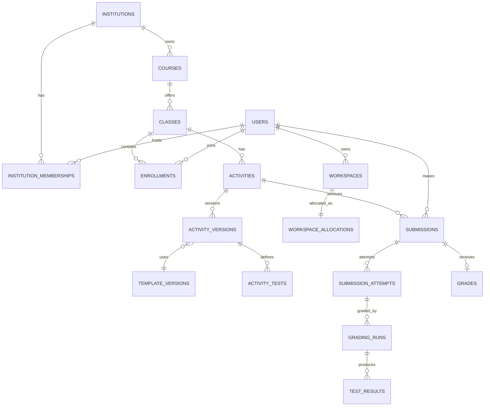

# SQWeb Data Model

Status: Approved planning baseline  
Database: Separate Cloud SQL for MySQL 8.4 platform instance  
Last updated: 2026-08-17

## 1. Modeling rules

- UUID primary keys are generated server-side.
- All timestamps are UTC.
- Mutable records contain `created_at`, `updated_at`, and an optimistic `version` where concurrent edits matter.
- Institution-owned records carry `institution_id`, directly or through an enforced parent.
- Foreign keys, unique constraints, and transactions enforce authorization-relevant integrity.
- Published activity/template versions and submission attempts are immutable.
- Soft deletion is used only where recovery/audit requires it; retention cleanup performs final deletion.
- SQL text, expected datasets, and hidden test details are not written to general logs.
- Object paths and database names are opaque generated values.

## 2. Identity and institution tables

| Table                     | Fields                                                                                    | Important constraints                       |
| ------------------------- | ----------------------------------------------------------------------------------------- | ------------------------------------------- |
| `institutions`            | `id`, `name`, `slug`, `status`, `timezone`, `settings_json`                               | Unique slug                                 |
| `users`                   | `id`, `firebase_uid`, `email`, `display_name`, `status`, `last_login_at`                  | Unique Firebase UID; normalized email index |
| `institution_memberships` | `id`, `institution_id`, `user_id`, `role`, `approval_state`, `approved_by`, `approved_at` | Unique institution/user/role                |
| `departments`             | `id`, `institution_id`, `code`, `name`, `status`                                          | Unique code per institution                 |
| `programs`                | `id`, `institution_id`, `department_id`, `code`, `name`                                   | Unique code per institution                 |
| `terms`                   | `id`, `institution_id`, `name`, `starts_at`, `ends_at`, `status`                          | Valid date interval                         |
| `courses`                 | `id`, `institution_id`, `department_id`, `code`, `title`, `description`                   | Unique code per institution                 |

## 3. Class and enrollment tables

| Table            | Fields                                                                                                   | Important constraints                                    |
| ---------------- | -------------------------------------------------------------------------------------------------------- | -------------------------------------------------------- |
| `classes`        | `id`, `institution_id`, `course_id`, `term_id`, `section`, `owner_teacher_id`, `status`, `schedule_json` | Parent resources share institution                       |
| `class_teachers` | `class_id`, `teacher_id`, `permission_level`                                                             | Unique class/teacher; active teacher membership required |
| `enrollments`    | `id`, `class_id`, `student_id`, `state`, `joined_at`, `removed_at`                                       | Unique active class/student                              |
| `class_invites`  | `id`, `class_id`, `code_hash`, `expires_at`, `usage_limit`, `usage_count`, `revoked_at`                  | Never store plaintext code after creation                |

## 4. Template and activity tables

| Table                 | Fields                                                                                                                 | Important constraints                            |
| --------------------- | ---------------------------------------------------------------------------------------------------------------------- | ------------------------------------------------ |
| `workspace_templates` | `id`, `institution_id`, `owner_id`, `name`, `description`, `status`                                                    | Name unique per owner where active               |
| `template_versions`   | `id`, `template_id`, `version_number`, `mysql_version`, `checksum`, `state`, `published_at`                            | Unique template/version; immutable after publish |
| `template_artifacts`  | `id`, `template_version_id`, `artifact_type`, `storage_path`, `size_bytes`, `checksum`                                 | Opaque private storage path                      |
| `activities`          | `id`, `institution_id`, `class_id`, `owner_id`, `type`, `title`, `status`, `current_version_id`                        | Owner must teach class                           |
| `activity_versions`   | `id`, `activity_id`, `version_number`, `template_version_id`, `instructions`, `starter_sql_ref`, `max_points`, `state` | Immutable after publish                          |
| `activity_policies`   | `id`, `activity_version_id`, `policy_version`, `allowed_classes_json`, `limits_json`, `destructive_rules_json`         | One active policy per version                    |
| `activity_tests`      | `id`, `activity_version_id`, `visibility`, `test_type`, `expected_ref`, `points`, `sort_order`, `comparison_json`      | Hidden expected data service-only                |
| `activity_schedules`  | `activity_version_id`, `publish_at`, `due_at`, `close_at`, `attempt_limit`, `late_policy_json`                         | `publish <= due <= close` when values exist      |

## 5. Workspace infrastructure tables

| Table                      | Fields                                                                                                                                                                                   | Important constraints                                            |
| -------------------------- | ---------------------------------------------------------------------------------------------------------------------------------------------------------------------------------------- | ---------------------------------------------------------------- |
| `workspaces`               | `id`, `institution_id`, `owner_id`, `scope_type`, `scope_id`, `template_version_id`, `state`, `quota_bytes`, `expires_at`                                                                | One active workspace per configured owner/scope                  |
| `workspace_allocations`    | `id`, `workspace_id`, `pool_instance_id`, `database_name`, `database_user`, `credential_secret_ref`, `allocated_at`, `released_at`, `cleanup_state`, `cleanup_attempts`, `cleanup_error` | Names unique; secret value never stored; cleanup retries bounded |
| `workspace_resets`         | `id`, `workspace_id`, `actor_id`, `reason`, `source_template_version_id`, `state`, `started_at`, `finished_at`                                                                           | Idempotency key unique per requested operation                   |
| `workspace_pool_instances` | `id`, `environment`, `region`, `service_ref`, `state`, `database_count`, `capacity_json`                                                                                                 | Infrastructure identifiers administrator-only                    |

The workspace Cloud SQL security domain also contains an `execution_control` database that workspace accounts cannot access. It stores only short-lived execution ID, actor/workspace binding, connection ID, deadline, and state for cancellation.

## 6. Submission and grading tables

| Table                 | Fields                                                                                                                           | Important constraints                     |
| --------------------- | -------------------------------------------------------------------------------------------------------------------------------- | ----------------------------------------- |
| `submissions`         | `id`, `activity_id`, `student_id`, `status`, `latest_attempt_id`                                                                 | Unique activity/student                   |
| `submission_attempts` | `id`, `submission_id`, `attempt_number`, `activity_version_id`, `sql_snapshot_ref`, `sql_checksum`, `submitted_at`, `late_state` | Unique submission/attempt; immutable      |
| `grading_runs`        | `id`, `attempt_id`, `grader_version`, `policy_version`, `state`, `automatic_points`, `started_at`, `finished_at`, `failure_code` | Idempotency key; historical runs retained |
| `test_results`        | `id`, `grading_run_id`, `activity_test_id`, `passed`, `points_awarded`, `safe_feedback`, `internal_detail_ref`                   | Internal detail never returned to student |
| `grades`              | `id`, `submission_id`, `automatic_points`, `manual_points`, `final_points`, `graded_by`, `released_at`, `version`                | One current grade; changes audited        |
| `feedback`            | `id`, `grade_id`, `attempt_id`, `author_id`, `audience`, `body`, `created_at`, `edited_at`                                       | Author and audience enforced              |

## 7. Workbench and communication tables

| Table              | Fields                                                                                                                                                                         | Important constraints                             |
| ------------------ | ------------------------------------------------------------------------------------------------------------------------------------------------------------------------------ | ------------------------------------------------- |
| `saved_queries`    | `id`, `institution_id`, `owner_id`, `workspace_scope`, `title`, `sql_ref_or_ciphertext`, `tags_json`                                                                           | Owner-scoped; retention policy                    |
| `query_executions` | `id`, `institution_id`, `actor_id`, `workspace_id`, `activity_id`, `classification`, `state`, `duration_ms`, `rows_returned`, `bytes_returned`, `error_category`, `started_at` | No credentials; SQL content separately controlled |
| `notifications`    | `id`, `recipient_id`, `type`, `title`, `body_or_ref`, `read_at`, `delivery_state`, `expires_at`                                                                                | Recipient-only read                               |
| `announcements`    | `id`, `institution_id`, `author_id`, `audience_json`, `title`, `body`, `publish_at`, `expires_at`, `state`                                                                     | Administrator publication                         |

## 8. Policy, audit, and operations tables

| Table                | Fields                                                                                                                                                                            | Important constraints            |
| -------------------- | --------------------------------------------------------------------------------------------------------------------------------------------------------------------------------- | -------------------------------- |
| `policy_definitions` | `id`, `institution_id`, `scope_type`, `scope_id`, `version_number`, `policy_json`, `state`                                                                                        | Immutable published versions     |
| `quota_usage`        | `id`, `subject_type`, `subject_id`, `metric`, `period_start`, `period_end`, `usage`, `limit_value`                                                                                | Unique subject/metric/period     |
| `audit_events`       | `id`, `institution_id`, `actor_id`, `effective_role`, `action`, `target_type`, `target_id`, `request_id`, `result`, `reason`, `before_ref`, `after_ref`, `occurred_at`, `ip_hash` | Append-only application behavior |
| `service_incidents`  | `id`, `service`, `severity`, `state`, `summary`, `started_at`, `resolved_at`                                                                                                      | Administrator-only               |
| `report_exports`     | `id`, `requester_id`, `report_type`, `filters_json`, `storage_path`, `state`, `expires_at`                                                                                        | Short-lived signed access        |

## 9. Key relationships



## 10. Grading comparison model

`comparison_json` explicitly records:

- Whether row order matters.
- Whether column order matters.
- Duplicate-row handling; duplicates are significant by default.
- Strict NULL behavior.
- Numeric type and tolerance; DECIMAL exact, floating default `1e-6`.
- Text collation/case rules inherited from the template unless overridden.
- UTC date/time normalization.
- Expected schema, result, or modified-state target.

## 11. Storage object layout

```text
institutions/{institutionId}/templates/{templateVersionId}/{artifactId}
institutions/{institutionId}/activities/{activityVersionId}/{artifactId}
institutions/{institutionId}/submissions/{attemptId}/{artifactId}
institutions/{institutionId}/grading-private/{gradingRunId}/{artifactId}
institutions/{institutionId}/imports/{importId}/{artifactId}
institutions/{institutionId}/exports/{exportId}/{artifactId}
```

Clients never construct or authorize these paths independently. Hidden grading paths are service-only.

## 12. Migration and integrity policy

- Schema changes use reviewed versioned migrations.
- Each deployment declares backward compatibility and rollback behavior.
- Destructive platform migrations require a tested backup and restore path.
- Authorization-critical constraints are tested against real MySQL, not only mocked repositories.
- Seed data is limited to controlled local/test fixtures.
